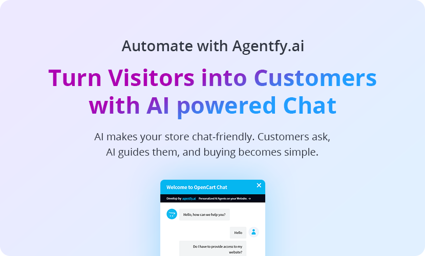

[](https://www.opencart.com/index.php?route=marketplace/extension/info&extension_id=46749)

# Agentfy AI OpenCart Extension 🤖🛍️

**Turn Browsing into Buying with AI-Powered Chat for Your OpenCart Store**

Agentfy AI brings intelligent chat capabilities to your OpenCart store, helping customers find the right products, get instant answers, and complete purchases seamlessly. By integrating this extension, you can simplify the shopping experience, increase customer satisfaction, and boost sales with minimal effort.

[**View on OpenCart Marketplace**](https://www.opencart.com/index.php?route=marketplace/extension/info&extension_id=46749)

---

## ✨ **Why Agentfy AI?**

- **24/7 Support:** Always available to assist customers, day or night.  
- **Simplified Shopping:** Guide visitors to the exact products they need.  
- **Boost Sales:** Intelligent suggestions convert visitors into buyers.  
- **Easy Integration:** Seamlessly connects with your OpenCart store.  
- **Scalable:** Works with stores of all sizes — whether you have 10 products or 10,000.

---

## 🚀 **Features**

- **Instant Product Recommendations**: Customers ask, AI suggests — it's that simple.  
- **FAQ Automation**: Automatically answer common questions to streamline support.  
- **Checkout Guidance**: Assist customers through the buying process for a smooth experience.  
- **Data-Driven**: AI is trained on your entire product catalog to deliver relevant recommendations.

---

## 🛠️ **Getting Started**

1. **Create an Account**: Sign up on [Agentfy.ai](https://agentfy.ai) and contact our support team to activate your account.  
2. **Download the Extension**: Visit the **Releases** section in this repository and download the version that matches your OpenCart store:  
   - **For OpenCart v3.x** – Select the release tagged for OpenCart 3.  
   - **For OpenCart v4.x** – Select the release tagged for OpenCart 4.
3. **Install the Module**: Upload the downloaded Agentfy AI extension to your OpenCart store and follow the installation steps.
4. **Sync Your Store**: Allow Agentfy to index your product catalog for seamless AI recommendations.
5. **Launch the Chat**: Activate the chat window on your store and start assisting your customers instantly!

---

## 🔄 **Setup**

Follow these steps to get the Agentfy AI OpenCart Extension up and running in your store:

1. **Create an Account and API Key**:  
   - Sign up for an account at [Agentfy.ai](https://agentfy.ai).  
   - Contact us at support[@]agentfy.ai to get your account approved.
   - Generate your **API Key** from the [API Keys page](https://agentfy.ai/apiKeys).  

2. **Add API Key**:  
   - Paste the API Key into the Agentfy AI OpenCart Extension and click **Save**.

3. **Index Your Store Data**:  
   - Navigate to the **Sources** tab. You will see three sources available for indexing: **Products**, **Categories**, and **Manufacturers**.  
   - Click the **Index 🔄** button for **Products** to begin indexing.  

4. **Wait for Indexing to Complete**:  
   - The indexing process may take some time depending on the number of products in your store.  
   - **Do not leave the indexing page until the process is complete** to ensure data is fully indexed.

5. **Create Your AI Agent**:  
   - Go to the **Agent** tab and click **Create Agent**.  
   - Provide a name and a prompt for your agent, then click **Save**.

6. **Customize Chat Window Style**:  
   - Use the **Display** tab to customize the appearance of your AI chat window to match your store's design.

---

### 📋 **Example Prompt for Your AI Agent**

Here’s a sample prompt you can use to guide your AI assistant:

```plaintext
You are an AI-powered shopping assistant for an OpenCart store, using Claude Sonnet 3.5. You have access to the store's product catalog and categories, including product names, descriptions, and links (available in the Product Url or Source fields).

Your Role:

- Provide quick, friendly, and helpful responses to customer inquiries.
- Suggest 2-3 products when appropriate.
- Include product links in your suggestions.
- Keep your replies short, simple, and to the point.

Examples:

Customer: "I'm looking for a winter jacket."  
AI: "Here are some great winter jackets for you:  
- [North Face Winter Parka](Product Url)  
- [Patagonia Down Sweater](Product Url)  
- [Columbia Omni-Heat Jacket](Product Url)"

Customer: "Do you sell wireless headphones?"  
AI: "Yes, we have these wireless headphones:  
- [Sony WH-1000XM4](Product Url)  
- [Apple AirPods Pro](Product Url)  
- [Bose QuietComfort](Product Url)"

Tone:  
Friendly, concise, and professional. Aim to make the shopping experience seamless and enjoyable.

Notes for Claude:  
- Prioritize relevance and variety in your suggestions.  
- If a customer question isn’t clear, ask for clarification politely.  
- Always focus on making it easy for customers to find what they need.
```

Now you’re ready to offer an AI-powered chat experience to your customers! 🚀

---

## 📩 **Join the Closed Beta**

We're currently in a closed beta phase. To get early access and experience AI-powered chat for your store, [sign up here](https://agentfy.ai).

---

**Make Shopping Easy. Turn Visitors into Customers. Empower Your Store with Agentfy AI.** 💬🚀

---

Happy Selling! 🎉  
**Agentfy.ai Team**  

---

